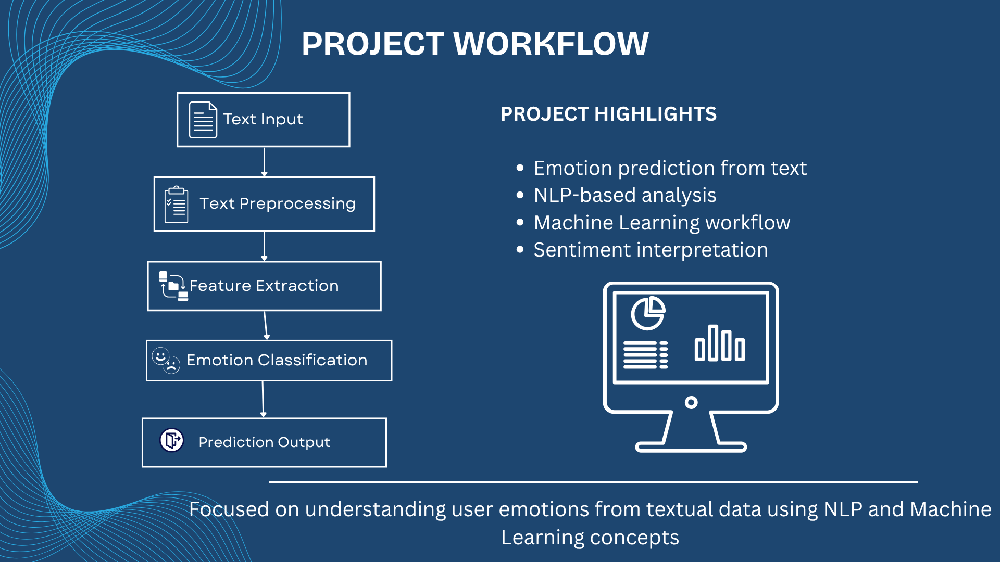

# Emotion Detection from Text using NLP

## 🚀 Overview
This project focuses on detecting emotions from textual comments and feedback using Natural Language Processing and Machine Learning concepts.

----

## 🏢 Internship Experience
The project was developed during my TCS iON internship and helped me to understand how text data can be processed and used for emotion-based classification.

----

## 🎯 Objective
To analyze textual feedback and identify user emotions using NLP techniques.

---

## 🛠 Technologies Used
- Python
- NLP
- Machine Learning
- Deep Learning
- Text Preprocessing

-----

## 📊 Project Workflow
1. Text Input
2. Text Preprocessing
3. Feature Extraction
4. Emotion Classification
5. Prediction Output

----

## ✨ Key Learnings
- Text preprocessing techniques
- NLP workflow understanding
- Emotion classification concepts
- Machine Learning fundamentals

-----

## 📷 Project Presentation

The project presentation slides and project report are included in this repository as a PDF.

## 📈 Output 
The project helped in understanding how emotions can be identified from textual data using NLP and Machine Learning techniques.

