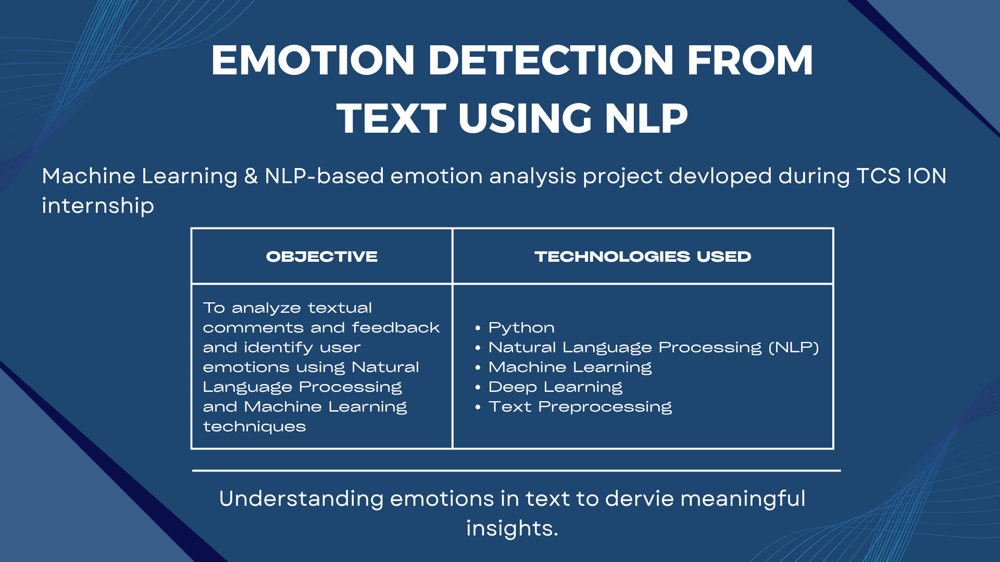

# Emotion Detection from Text using NLP

## 🚀 Overview
This project focuses on detecting emotions from textual comments and feedback using Natural Language Processing and Machine Learning concepts.

## 🏢 Internship Experience
The project was developed during my TCS iON internship and helped me to understand how text data can be processed and used for emotion-based classification.

## 🎯 Objective
To analyze textual feedback and identify user emotions using NLP techniques.

## 🛠 Technologies Used
- Python
- NLP
- Machine Learning
- Deep Learning
- Text Preprocessing

## 📊 Project Workflow
1. Text Input
2. Text Preprocessing
3. Feature Extraction
4. Emotion Classification
5. Prediction Output

## ✨ Key Learnings
- Text preprocessing techniques
- NLP workflow understanding
- Emotion classification concepts
- Machine Learning fundamentals

## 📷 Project Presentation

The project presentation slides and project report are included in this repository as a PDF.

## 💻 Project Code & Execution Files 

Google Colab Notebook:
- [Emotion Detection Notebook](https://colab.research.google.com/drive/1IMGooSHsr5u--kafW8ER0-TTgMP-JtNL?usp=sharing)

- [NLP Model Implementation](https://colab.research.google.com/drive/1ARxdF1H15mTKFZcXLYZ0Gg3f0UEcVKDl?usp=sharing)

- [LSTM Emotion Classification Model](https://colab.research.google.com/drive/16zZgja790OXWiz7Xw8or7BV0QXHtxVTb?usp=sharing)

## 📈 Output 
The project successfully demonstarted emotion classification from textual data using NLP and Machine Learning techniques.

 👩‍💻 Author
**Varsha Sundararaj**
Business Analytics Postgraduate @ Dublin Business School  
Aspiring Data Analyst | NLP | SQL | Python

## 🔗 Connect With Me
- LinkedIn: https://www.linkedin.com/in/varsha-sundararaj-40a463201
- GitHub: https://github.com/varshasundararaj-analytics
